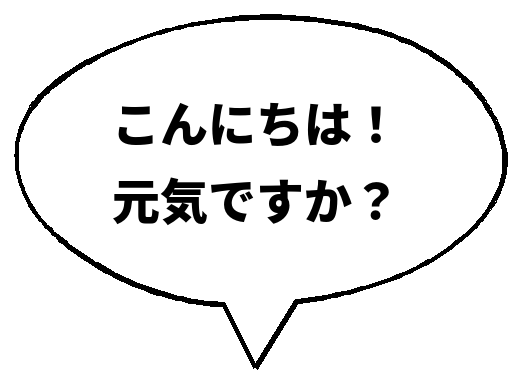

# speech_bubble.py

日本語テキストを漫画風の**吹き出し画像（背景透過 PNG）**にして出力する Python スクリプトです。
縦書き（デフォルト）・横書き、複数の吹き出し形状（楕円・角丸・四角・ギザギザ・手書き風）に対応しています。



## 特徴

- 背景は透過（RGBA PNG）。そのまま画像や漫画に重ねられます。
- 横書き／縦書き対応。縦書きでは長音符「ー」や括弧・三点リーダーを自動で回転。
- 吹き出しの形を 6 種類から選択。**手書き風 (`hand`)** はペン入れ風のゆらいだ輪郭。
- しっぽ（出っ張り）の向き・大きさを指定可能。手書き風は本体としっぽが継ぎ目なく一体化。
- システムの **Noto Sans CJK** を自動検出して使用。

## 必要なもの

- [uv](https://docs.astral.sh/uv/)（依存パッケージは自動でインストールされます）
- 日本語フォント（**Noto Sans CJK** 推奨）
  - Debian/Ubuntu: `sudo apt install fonts-noto-cjk`
  - システムに無くても、`--font` でフォントファイルを直接指定できます

依存パッケージ（Pillow）はスクリプト先頭の [PEP 723](https://peps.python.org/pep-0723/) インラインメタデータに記載されており、`uv run` 実行時に自動で用意されます。手動インストールは不要です。

## 使い方

```bash
# 一番シンプル（縦書き・手書き風・下しっぽ）→ bubble.png を出力
uv run speech_bubble.py "こんにちは！"

# 改行は \n で。出力先は -o で指定
uv run speech_bubble.py "こんにちは！\n元気ですか？" -o out.png

# 形を変える（楕円など）
uv run speech_bubble.py "こんにちは！\n元気ですか？" --shape ellipse

# しっぽの位置を時計の時間で指定（1.5時=右上）
uv run speech_bubble.py "こっち！" --tail-clock 1.5

# 好きなフォントを指定（.ttc はフォント番号も指定可）
uv run speech_bubble.py "好きな書体で" --font /path/to/font.otf
uv run speech_bubble.py "明朝体で" --font /usr/share/fonts/opentype/noto/NotoSerifCJK-Bold.ttc --font-index 3

# 横書きにする（デフォルトは縦書き）
uv run speech_bubble.py "なるほど…\nそういうことか" --horizontal

# 叫び（ギザギザ）＋しっぽ右下＋フォント大きめ
uv run speech_bubble.py "うわあああ！" --shape jagged --tail bottom-right --font-size 64
```

ヘルプは `uv run speech_bubble.py -h` で確認できます。

## オプション一覧

| オプション | 説明 | 既定値 |
|---|---|---|
| `text`（位置引数） | 吹き出しに入れる日本語テキスト（`\n` で改行） | （必須） |
| `-o, --output` | 出力ファイルパス | `bubble.png` |
| `--shape` | 吹き出しの形：`ellipse` / `rounded` / `rectangle` / `jagged` / `burst` / `hand` | `hand` |
| `--tail` | しっぽの向き：`bottom` / `bottom-left` / `bottom-right` / `top` / `top-left` / `top-right` / `left` / `right` / `none` | `bottom` |
| `--tail-clock` | しっぽの位置を時計の時間で指定（`12`=上, `3`=右, `6`=下, `9`=左。`4.5` など小数可）。指定すると `--tail` より優先 | （未指定） |
| `--tail-scale` | しっぽの大きさ倍率 | `1.0` |
| `--vertical` / `--no-vertical` | 縦書き／横書きの切替 | 縦書き |
| `--horizontal` | 横書きにする（`--no-vertical` と同じ） | （縦書き） |
| `--font` | 使用するフォントファイル(`.ttf`/`.otf`/`.ttc`)のパス。未指定ならシステムの日本語フォントを自動検出 | （自動検出） |
| `--font-index` | フォントコレクション(`.ttc`)内のフォント番号 | `0` |
| `--font-size` | フォントサイズ(px) | `48` |
| `--max-chars` | 1 行（列）の最大文字数で自動折り返し | `8` |
| `--line-width` | 輪郭線の太さ(px) | `4` |
| `--padding` | 文字と縁の余白(px) | `28` |
| `--line-gap` | 横書きの行間倍率 | `1.1` |
| `--char-gap` | 縦書きの字間倍率 | `1.15` |
| `--col-gap` | 縦書きの列間倍率 | `1.4` |
| `--no-trim` | 余白の自動トリミングをしない | （トリミング有効） |

### 手書き風（`--shape hand`）専用オプション

| オプション | 説明 | 既定値 |
|---|---|---|
| `--seed` | 揺れ方を決める乱数シード（同じ値なら毎回同じ絵）。未指定なら実行ごとにランダム（使った値は出力に表示） | （ランダム） |
| `--wobble` | 輪郭の揺れの強さ | `1.0` |
| `--strokes` | 線の重ね描き回数（多いほどラフ） | `2` |

## 吹き出しの形

| `--shape` | 見た目 | 用途 |
|---|---|---|
| `ellipse` | 楕円 | 標準のセリフ |
| `rounded` | 角丸長方形 | ナレーション・説明 |
| `rectangle` | 長方形 | カチッとした囲み |
| `jagged` | 軽いギザギザ | 強めのセリフ |
| `burst` | 爆発形 | 叫び・効果 |
| `hand` | 手書き風（ゆらいだ輪郭） | 漫画らしい柔らかさ |

## 仕組みのメモ

- **手書き風**: 楕円の輪郭を点列にし、整数次の正弦波（低周波ノイズ）で半径を揺らして「ゆらゆら」した閉曲線を作成。同じパスを少しずつズラして数回重ね描き（sketchy）することでペン入れ風の線にしています。`--seed` 未指定なら実行ごとにランダムな揺れになり（使ったシードは出力に表示）、`--seed <値>` で固定すると同じ絵を再現できます。
- **継ぎ目なしのしっぽ**: 本体としっぽを別々に描くと付け根に境界線が出るため、本体輪郭のしっぽ付け根区間を削除し、しっぽ先端へ迂回させた **1 本の連続した閉路** として描画しています。

## ライセンス

自由に利用・改変してください。
